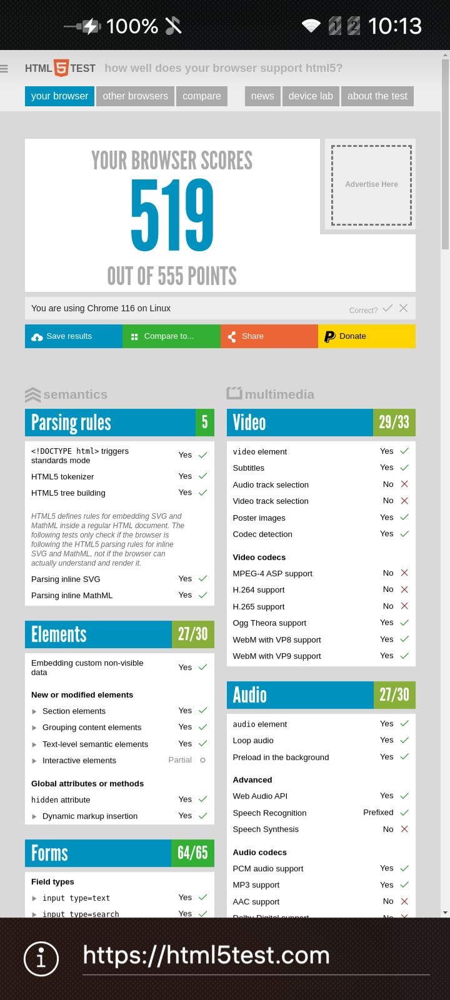

# Tiny Browser

Проект представляет собой пример использования WebView на движке CEF.

Основная цель — показать минимальное приложение с помощью WebView на движке CEF.

## Условия использования и участия

Исходный код проекта предоставляется по [лицензии](LICENSE.BSD-3-Clause.md),
которая позволяет использовать его в сторонних приложениях.

[Соглашение участника](CONTRIBUTING.md) регламентирует права,
предоставляемые участниками компании «Открытая Мобильная Платформа».

Информация об участниках указана в файле [AUTHORS](AUTHORS.md).

[Кодекс поведения](CODE_OF_CONDUCT.md) — это действующий набор правил
компании «Открытая Мобильная Платформа»,
который информирует об ожиданиях по взаимодействию между членами сообщества при общении и работе над проектами.

## Структура проекта

Проект имеет стандартную структуру приложения на базе C++ и QML для ОС Аврора.

* Файл **[ru.auroraos.ChromiumTinyBrowser.pro](ru.auroraos.ChromiumTinyBrowser.pro)** описывает структуру проекта для системы сборки qmake.
* Директория **[icons](icons)** содержит иконки приложения для поддерживаемых разрешений экрана.
* Директория **[qml](qml)** содержит исходный код на QML и ресурсы интерфейса пользователя.
    * Директория **[cover](qml/cover)** содержит реализации обложек приложения.
    * Директория **[icons](qml/icons)** содержит дополнительные иконки интерфейса пользователя.
    * Директория **[pages](qml/pages)** содержит страницы приложения.
  * Файл **[ru.auroraos.ChromiumTinyBrowser.qml](qml/ru.auroraos.ChromiumTinyBrowser.qml)** предоставляет реализацию окна приложения.
* Директория **[rpm](rpm)** содержит настройки сборки rpm-пакета.
  * Файл **[ru.auroraos.ChromiumTinyBrowser.spec](rpm/ru.auroraos.ChromiumTinyBrowser.spec)** используется инструментом rpmbuild.
* Директория **[src](src)** содержит исходный код на C++.
  * Файл **[ru.auroraos.ChromiumTinyBrowser.cpp](src/ru.auroraos.TinyBrowser.cpp)** является точкой входа в приложение.
* Директория **[translations](translations)** содержит файлы перевода интерфейса пользователя.
* Файл **[ru.auroraos.ChromiumTinyBrowser.desktop](ru.auroraos.ChromiumTinyBrowser.desktop)** определяет отображение и параметры запуска приложения.
  
## Совместимость

Проект совместим с ОС Аврора версии 5 и выше.

## Сборка проекта

Проект собирается обычным образом с помощью Аврора SDK.

## Снимки экранов

## This document in English

- [README.md](README.md)
